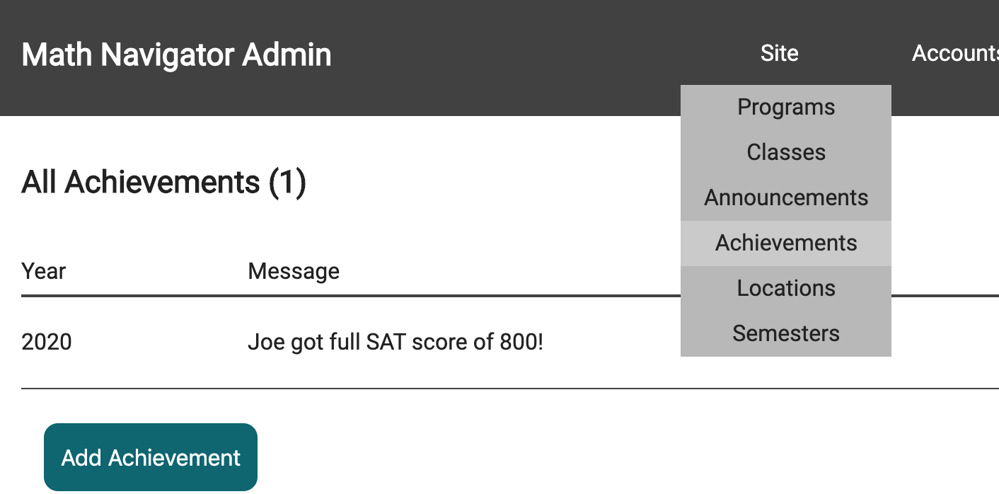

# General Onboarding

The MathNavigator repository follows a microservice architecture. This means that the application is made up of many "services", each service haivng a particular role. And together, the services make up the entire application.

We use a service called **Docker** to manage our microservices. Please refer to the Docker resources [here](../resources/docker) to learn how to use Docker. You should install Docker and DockerDesktop onto your computer and learn the basics of Containerization. 

## Overview

Once Docker is installed, you'll be doing the following:
 
- Create and spin up all backend services with Docker (i.e. Orion & MySql)
- Run the Gemini Admin web-client
- Run the Gemini User web-client
- Test the Admin - User - Services interaction

Let's get started!

## Docker-Compose

If DockerDesktop was installed correctly, you should be able to use `docker-compose` in a CLI. Use your CLI and traverse to the `constellations` folder, use `docker-compose` to build and create your services. Run this command to start all services.

```unix
docker-compose up -d
```

Once it is done running, you should be able to see all services as healthy in the Docker Desktop app.


***Note*** Even though our stack uses MySQL, you won't have to install it because Docker will already create a MySQL image for you (as done in `docker-compose.yml`).

When you are finished working with these services, you can use `docker-compose stop` to stop and deactivate all containers. To reactivate them, use `docker-compose start`. This will stop the services without destroying the containers. Use `docker-compose down` to stop and kill all containers. Be careful with using this command! This will destroy the containers, meaning you will lose all your data (if a MySQL image is destroyed, all data stored into MySQL will be lost).

## Starting Gemini Admin

View the [gemini-admin](./gemini-admin) directory and follow the instructions there. If the website builds correctly, you should see the website serving at `http://localhost:9001`. Go to the website, in the header, select Site > Achievements and click on Add an Achievement. Make sure all fields are filled and saved.



## Starting Gemini User

View the [gemini-user](./gemini-user) directory and follow the instructions.

If the website builds correctly, you should see the website serving at `http://localhost:9000`. At this point, you should have two websites running (admin and user). In the user website, in the header, go to Accomplishments > Student Achievements and you should see the same information as you input in the Admin site.

## Testing the Backend Services

Cool! So at this point, you should have two websites that somehow are connected to each other. The admin website allows administrators to write data, while the user website is supposed to display the data to students and parents.

### So what's going on here?

The Gemini sites (admin & user) are both connected to the `orion` web server which has been created by Docker. Orion is the web server that serves data for requests sent by any web client. However, Orion doesn't actually store data. All data (user, programs, classes, etc.) is stored in a MySQL database. When a web client requests data from Orion, Orion connects to MySQL to retrieve the requested data, and then transforms the data to be more easily processed by the web client.


Anyway, you're finished! Now you know how to spin up Docker containers and run the two Gemini websites!

## Starting Development

If you're a back-end developer, you will probably be working on `orion`. Go to the [orion](./orion) directory and read the README file there. You will also need to install Golang to start developing.

If you're a front-end developer, you won't need any more installation steps. Go to the [gemini-user](./gemini-user) and [gemini-admin](./gemini-admin) directories to read more about developing in those projects.

---

For more information about using `docker-compose`, go [here](./onboarding_docker-compose.md).
