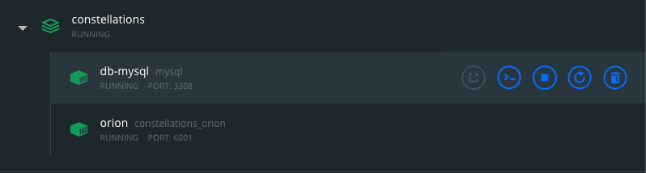
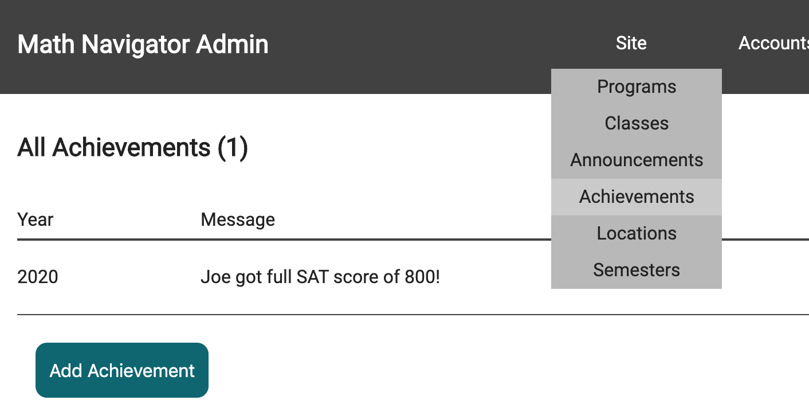
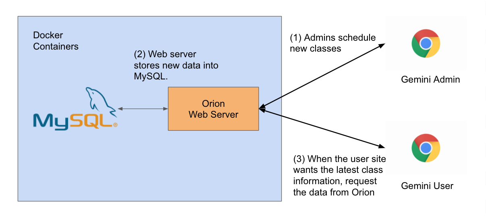
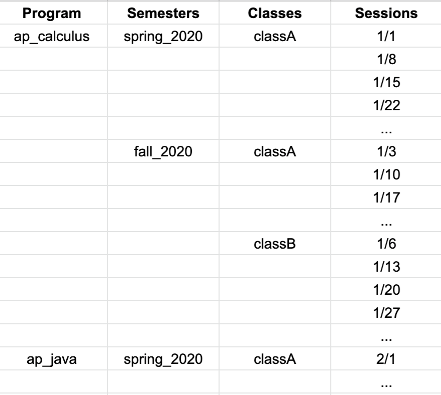

# General Onboarding

The MathNavigator repository follows a microservice architecture. This means that the application is made up of many "services" (mini-programs), each service having a particular role and perform dedicated functionalities. And together, the services collaborate to make up the entire application.

We use a software service called **Docker** to manage our microservices. Please refer to the Docker resources [here](../../resources/docker) to learn how to use Docker. You should install Docker and DockerDesktop onto your computer and learn the basics of Containerization. 

Before proceeding, please read the foundations of web applications and the roles of web-servers and web-clients. [Link here](https://github.com/ahsu1230/mathnavigatorSite/blob/master/resources/01_webapps.md).

## Overview

In this onboarding, you'll be doing the following:
 
- Create and spin up all backend services (i.e. Orion & MySql)
- Run the Gemini Admin web-client
- Run the Gemini User web-client
- Test the Admin - User - Services interaction

Let's get started!

***Warning for Mac users*** At this time, Docker-Desktop is not supported for Macs older than 2010 or OS versions earlier than 10.13. If you have an older Mac OS, please refer to the [alternative guide](./guide_alternative.md).

***Warning for Windows users*** We will be downloading Windows 10, version 2004. This will allow us to download docker-desktop. [Windows 10 version 2004 setup](constellations/onboarding/guide_windows10_2004.md) 

## Docker-Compose

If DockerDesktop was installed correctly, you should be able to use `docker-compose` in a CLI. Use your CLI and traverse to the `constellations` folder. Once there, use `docker-compose` to build, create, and start the services by running this command.

```unix
docker-compose up -d
```

When it's finished, you should be able to see all services as healthily running in the Docker Desktop app.



***Note*** Even though our stack uses MySQL, you won't have to install it because Docker will already create a MySQL image for you (as done in `docker-compose.yml`).

When you are finished working with these services, you can use `docker-compose stop` to stop and deactivate all containers. To reactivate them, use `docker-compose start`. This will stop the services without destroying the containers. Use `docker-compose down` to stop and kill all containers. Be careful with using this command! This will destroy the containers, meaning you will lose all your data (if a MySQL image is destroyed, all data stored into MySQL will be lost).

For more information about using `docker-compose`, go [here](./guide_docker-compose.md).

## Starting Gemini Admin

View the [gemini-admin](./gemini-admin) directory and follow the instructions there to install npm and get the admin website running. 

If the website builds correctly, you should see the website serving at `http://localhost:9001`. Go to the website, in the header, select Site > Achievements and click on Add an Achievement. Make sure all fields are filled and saved.



## Starting Gemini User

View the [gemini-user](./gemini-user) directory and follow the instructions to get the user website running.

If the website builds correctly, you should see the website serving at `http://localhost:9000`. At this point, you should have two websites running (admin and user). In the user website, in the header, go to Accomplishments > Student Achievements and you should see the same information as you input in the Admin site.

## Testing the Backend Services

Cool! So at this point, you should have two websites that somehow are connected to each other. The admin website allows administrators to write data, while the user website is supposed to display the data to students and parents.

### Web-client and Web-server interactions

The Gemini sites (admin & user) are both connected to the `orion` web server which has been created by Docker. Orion is the web server that serves data for requests sent by any web client. However, Orion doesn't actually store data. All data (user, programs, classes, etc.) is stored in a MySQL database. When a web client requests data from Orion, Orion connects to MySQL to retrieve the requested data, and then transforms the data to be more easily processed by the web client.



## Closing out the services

This application will continue to run as long as the CLI processes for the websites and the Docker services continue to run. To quit out of the websites, close their corresponding CLI tab/window or use `Ctrl-C`. To stop the Docker services, use `docker-compose stop`.

For more information about using `docker-compose`, take a look [here](./guide_docker-compose.md).

## Explaining Entities

Here, I'll explain the vernacular behind Math Navigator. This project is made up of many *entities* (think like objects in object-oriented programming). An *entity* could be a program, a class, a student, a teacher, etc. We'll talk about what they are and how they relate to each other.

At Math Navigator, we teach students many different **programs**. A program is simply a course/subject such as Geometry, AP Calculus, SAT1 Math, Reading Comprehension, Java Computer Programming, etc. We teach these subjects multiple times a year and following the school semester scheduling. For example, I could teach AP Calculus for the Spring 2020 and the Fall 2020 **semesters**. There are some programs that are very popular for a particular semester, so we try to create multiple **classes** for the program. For the Spring 2020 Semester, we could have a class A that meets every Tuesday evening and a class B that meets every Saturday evening. Every class meets for multiple **sessions**. For instance, class A first meets on Tuesday January 3rd, and then again on Tuesday January 10th. The session represents every occurance of a class. If a class is scheduled to include 16 weeks, you can expect to have 16 sessions when you register for the class. 
Classes are scheduled to occur weekly at a certiain **location**, which could be a physical address (Winston Churchill High School) or maybe even online (via Zoom & provided url).

And finally, there are two types of **users**. There are students and parents/guardians. Usually, a student will be attending class sessions while parents/guardians want to be up-to-date with upcoming programs or **announcements** and often handle payment matters.

There are more entities, but this is the fundamental vocabulary which will be very helpful moving forward when you start development.



## Starting Development

If you're a back-end developer, you will probably be working on `orion`. Go to the [orion](../orion) directory and read the README file there. You will also need to install Golang to start developing.
If you're a front-end developer, you won't need any more installation steps. Go to the [gemini-user](../gemini-user) and [gemini-admin](../gemini-admin) directories to read more about developing in those projects.
