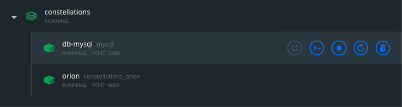

# Starting services with Docker-Compose

In the `constellations` folder, use `docker-compose` to manage your services. Run this command to start all services.

```unix
docker-compose up -d
```

Once it is done running, you should be able to see all services as healthy in the Docker Desktop app.



When you are finished working with these services, you can use this command to deactive all of them.

```unix
docker-compose rm
```

## Docker-Compose commands

- `docker-compose up -d` to build and start all services
- `docker-compose build SERVICE` to rebuild a specified service. Run this if you made any changes to your application.
- `docker-compose start SERVICE` to start a specified service
- `docker-compose stop SERVICE` to stop a specified service
- `docker-compose restart SERVICE` to stop then start a specified service
- `docker-compose logs SERVICE` to view the logs of a specified service
- `docker-compose down` to stop and delete all active containers

Use `docker-compose -h` for more information about commands.

## Math Navigator services and ports

You can find the following services with their corresponding host/port locations. For webservers like `orion`, nothing will show up if you go to `localhost:6001`, but you can cUrl endpoints to `http://localhost:6001/api/...`.

- db-mysql: `localhost:3308`
- orion: `localhost:6001`

## Accessing the database

If you need to access the database, you can run this command:

```unix
docker-compose exec db-mysql bash
```

From there, you can use the mysql CLI.
```
mysql -u user -p
```

The password is `password` as listed in the `docker-compose.yml` file.

## Accessing a microservice

For debugging purposes, you can also access a Docker image using this command:

```
docker-compose exec SERVICE bash
```

This will allow you to use the Terminal CLI from inside the container.
