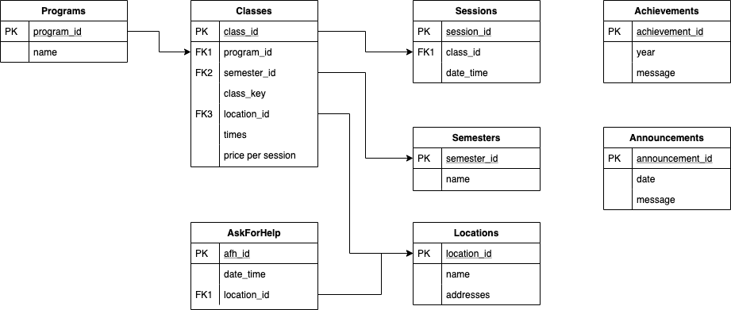
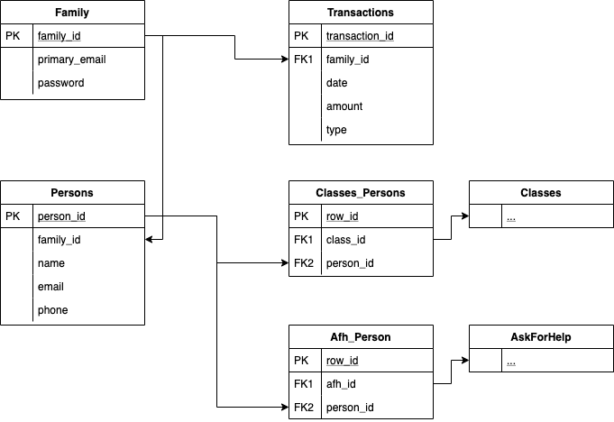

# Orion

Our core API service. This webserver will provide the main API to allow web clients to interact with our MySQL database. This is where users, programs, classes, announcements are created and persisted into the database.

## Pre-requirements

Make sure that Go is installed before proceeding: (https://github.com/ahsu1230/mathnavigatorSite/blob/master/resources/onboarding/install_go.md)

## How to run the Orion webserver

```unix
docker-compose build orion
docker-compose start orion
```

View your DockerDesktop to check if the `orion` service is running and healthy. When you are finished, use `docker-compose stop orion` to stop all services.

If you are not using Docker, use `go run main.go` to continually run the Orion webserver. Use `CTRL+C` to stop the webserver.

## Running Tests

To run all tests for the back-end web server, run:
```
go test ./...
```
You should see `ok`s and no failures.

## Formatting your code

```
go fmt ./...
```

## Navigating the codebase

There are 3 architecture "layers" to Orion.

- Domains - simple objects that represent an entity (i.e. a Program, a Class, a User, etc.)
  - Domains are very simple and don't have much logic to them.
  - All domains do are describe attributes of an entity.

- Controllers - objects that handle network stuff (JSON, HTTP Request & Responses, Serializing & Deserializing, etc.)
  - The controller layer is built on top of `gin` - a golang http framework.
  - Here, we define all the endpoints that allow a web-client to interact with our web-server.

- Repos - objects that handle database stuff (MySQL connections, Database queries, reads & writes, etc.)
  - For testing, database queries are checked via Datadog's SQL query validation.
  - Database migrations can be found in the `repos/migrations` folder.

## Domains and Repos

The entities are usually each represented by a single domain and an associated repo. Anytime you need to store or retrieve a `program`, you should use the `programRepo`. Take a look at this image to see a generic overview of how domains (represented by database tables) are related. Repos are the objects that handle read & write queries to these database tables. Note that there are more domains & relationships that are not included in this diagram for simplicity sake.





## Controllers

We define all HTTP endpoints here to give web-clients the ability to interact with the orion web-server. HTTP requests must specify the correct destination (which must match the web-server endpoint) in order to receive valid data in a HTTP response. 

For example, the `programController` can specify a "Create program" endpoint and a "Get all programs" endpoint. The "create program" endpoint requires a POST HTTP request to `/api/programs/create` while the "get all programs" endpoint requires a GET HTTP request to `/api/programs`. If you send correct data to the create endpoint (the full http request endpoint will look like: `http://localhost:8001/api/programs/create`), you can receive a 200 status code as the response, which means success. If you want the data for all programs, you can send a request to the "get all" endpoint and receive a 200 status code and a list of all programs in JSON format.

## Developing in Orion

When developing, I highly suggest following this 3 step process (I recommend each of these be a single git commit): 

- Changing the Domains & Database layer
  - Start in the `domains` package. Define the new entity or change to an existing entity there.
  - Add a database migration in `repos/migrations` directory. Make sure to create both a `xxxxx.up.sql` file and a `xxxxx.down.sql` file. Migration files are used to update databases from one version to another (i.e. from version 10 to the most recent version). Make sure that the `up.sql` file and the `down.sql` file are "opposite" operations.
  - Add/Edit the database access functions in the `repos` directory. Change a `_repo` file and test your changes with the matching `_repo_test` file.

- Changing the Controller layer
  - Add/Edit the controller function in the `controllers`. Make sure to also include `_controller_test` in your change.
  - To connect your controller to an endpoint, look inside the `router/handler.go` file. This is where all the server endpoints are dictated.

- Testing the full interaction using integration tests
  - Add a few tests in the appropriate file under `tests_integration`.

*Note with testing* Both Controllers and Repos are often declared as interfaces. The reasoning is to promote mock unit testing. Essentially, there are usually two implementations of every Controller and Repo. One implementation is for the business logic (works as you would expect), the other implementation is done by test classes which help simplify unit testing. This is called **mocking**.
