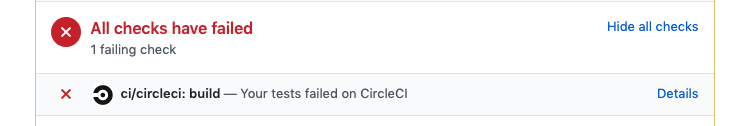

## CircleCI

https://circleci.com/

CircleCI is a Continuous Delivery (CD) and Continuous Integration (CI) tool. It is often used for automatically building a project every time a new feature is merged into Github.

Usually, if you wanted to build your app after a new feature, you would have to call a set of commands to test your app and then create the production version of your app.

CD/CI tools like CircleCI help you automatically do this and can automatically run tests for you to see if your new feature broke any existing features. This is especially useful for preventing developers from accidentally pushing in changes before passing critical tests.

A CircleCI build triggers whenever a new commit is pushed onto a remote [Github] branch. These tools simply wait for new changes to the codebase (whether merged into master or not) and activate its tests immediately.

### What happens if my Pull Request is failing CircleCI tests?

You can simply click on `Details` on the right of "Your tests failed on CircleCI" where you will see where your build is failing.

### How does it work?
Whenever CircleCI triggers a testing build, it will create an isolated environment on a separate machine in the cloud that will test your code. CircleCI will spin up a new machine, automatically download your code and run tests on it.

This helps us in two ways.
 - Prevents "It works on my machine" problems. Often times, developers run tests on their local computers and often forget about local dependencies that allow their machine to correctly pass tests. When another developer tests on their machine, it doesn't work. But whose fault is it? Using an isolated environment gives developers a source of truth. When tests successfully pass on CircleCI machines, the developers can pinpoint where their local environments have gone wrong.
 - Saves time. It allows us to continue working without having to run tests ourselves. When test frameworks start to get huge, building and testing can take a long time and use up our computer resources. Giving the heavy lifting to other machines frees up our computer to do other things :)

The isolated environments and new machines being spun up are handled by something called [Docker](https://www.docker.com/).
