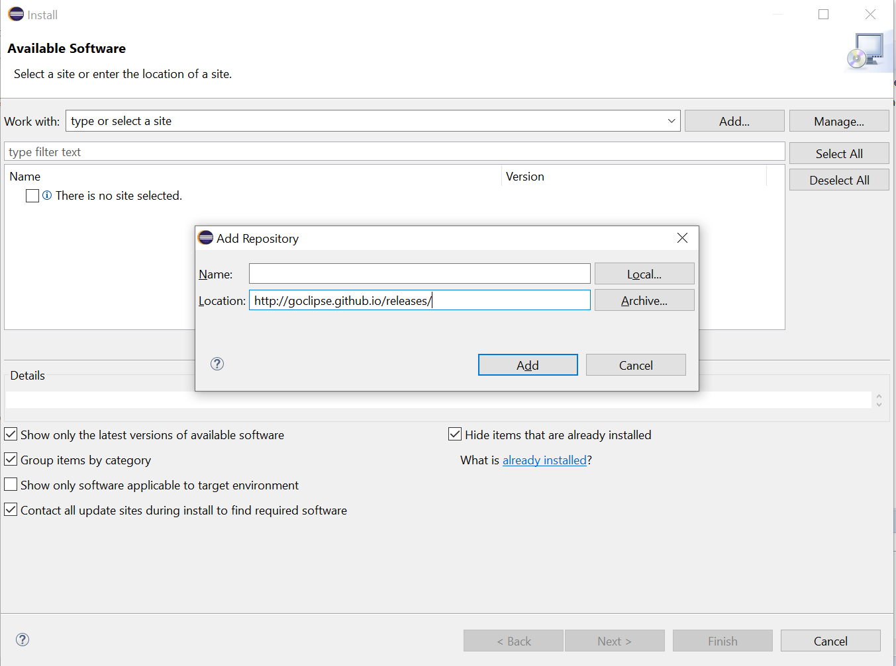
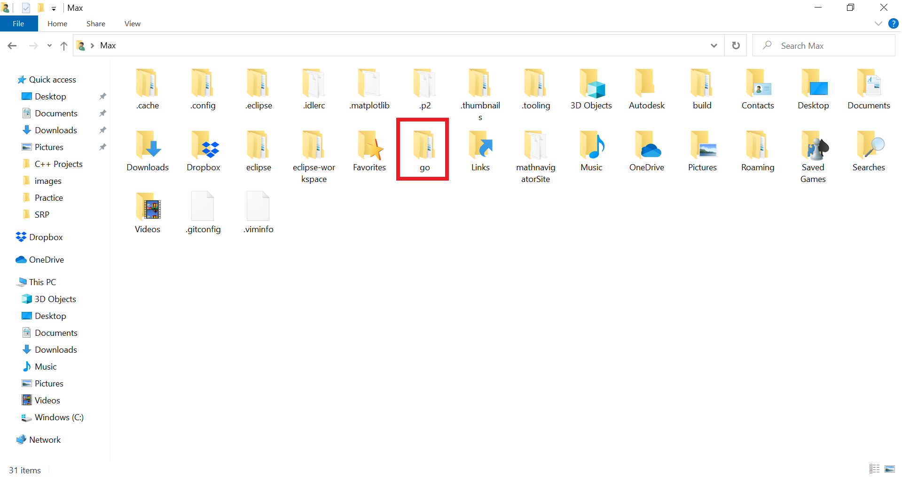
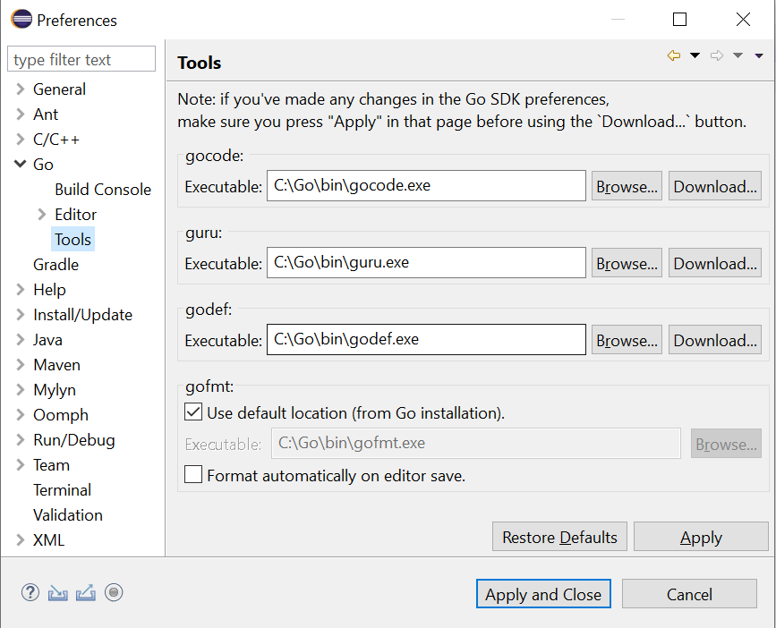

# Goclipse
Goclipse is an Eclipse plugin that adds IDE functionality for Go to Eclipse. If you already have Eclipse installed and don't want to get a different IDE for Go, this is a good option. However, if you don't have Eclipse already, you might be better off getting a more lightweight IDE instead.

You can find the official documentation [here](https://github.com/GoClipse/goclipse/tree/latest/documentation).
### Prerequisites:
Java VM version 8+ (I'm not sure why you need this, but the documentation says you do)
Eclipse 4.6+ (Neon or later)
Go
## Installing the Plugin
1. Open Eclipse and click `Help -> Install New Software...` in the file menu bar up top.
2. Click `Add...`, copy the URL [http://goclipse.github.io/releases/](http://goclipse.github.io/releases/) into the `Location` field, and click `Add`.



3. Select `Goclipse` in the `Work with:` field and select `GoClipse` in the checklist, then select `Next`.


4.  Follow the installation wizard instructions and agree to all terms and conditions that pop up.
## Adding the IDE Functionality
The plugin now supports syntax highlighting, but a few more steps need to be taken to get autocomplete and other functionalities.

Open the command prompt and enter in the following commands:
```
go get -u github.com/mdempsky/gocode
go get -u golang.org/x/tools/cmd/guru
go get -u github.com/rogpeppe/godef
```
Once done, go to the user folder and you should see a folder named `go`



Copy paste that folder to where your Go installation (which by default should be at `C:\Go`) is and merge the folders.

Now head back to Eclipse and click `Window -> Preferences` in the file menu bar up top. Click on `Go` on the right and make sure the directory of Go installation is set to `C:\Go`.


Double click on `Go` on the right bar and click on `Tools`. Set the executables for gocode, guru, and godef to the respective .exe files in `C:\Go\bin`:



Click `Apply and Close` to save all changes.
## Opening Files
One could manually open the .go files through `File -> Open File...` in the file menu bar every single time, but that gets tedious quickly. Instead, we can add the Math Navigator repo to the Project Explorer on the left.

Click `File -> Open Projects from File System...` in the file menu bar. Click the `Directory...` button and navigate to the repo, then select the entire controllers folder inside orion.


Check off the folder and click `Finish`. Note that this will not be a proper Eclipse project since it lacks certain files, so we won't be able to execute the programs directly from Eclipse, but that's fine since `go test ./...` works.
