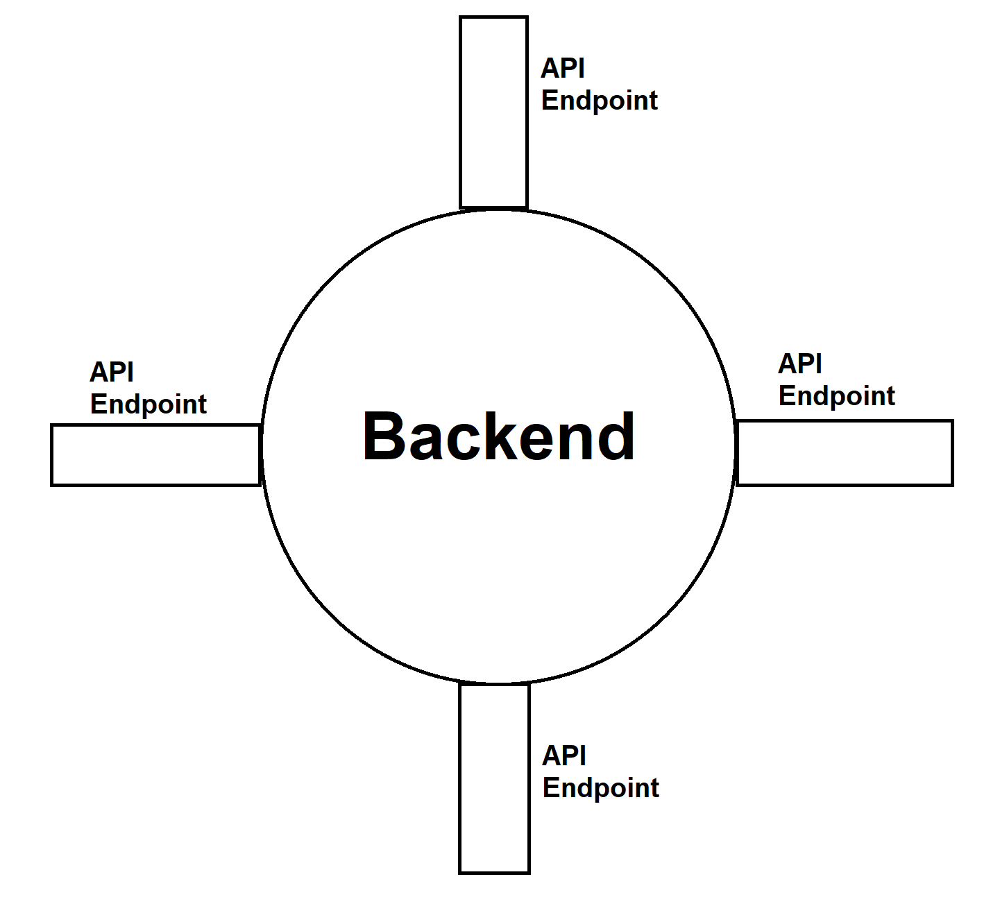

# API Endpoints
API endpoints are essentially points of communication in which a user can interact with and utilize an API's functions. In the context of this project, they are ways for frontend users to interact with and use backend functions.

Imagine the backend is an island with multiple ship ports. If a frontend user wants to interact with the backend, they send a ship to one of the ports to either deliver, retrieve, or modify information. These ships are called **HTTP requests**.
## What does an endpoint look like?
API endpoints are identified with a URL very similar to website URLs (e.g. `http://andymathnavigator.com/api/programs/v1/...`). The specific syntax of the API URL depends on how the backend developers designed it.

To demonstrate, the programs domain of this project will be used as an example.

API endpoints can receive URI parameters. For example, if you want to access a program with id "prog1", the syntax for this specific API is `/api/programs/v1/program/prog1`. If you want to access the program with id "prog2", send a HTTP request to `/api/programs/v1/program/prog2`.

API endpoints can also receive query parameters. For example, if you want to access all published programs from this sample API, you would use `/api/programs/v1/all?published=true`. You've probably seen query parameters in website URLs before. For example, if you search something in Google, the URL will look something like `https://www.google.com/search?source=hp&ei=DFKbXvqAIPCIytMP...`. The stuff after the question mark is a query parameter.

We use URI parameters when we want to identify a specific resource(s), and we use query parameters as to sort or filter resources.
## What does an HTTP request look like?
HTTP requests have multiple types, known as methods. A GET request retrieves information from an API, a POST request sends information to an API, and a DELETE request removes information from an API. There are other methods, but this project doesn't use them (yet).

For example, the above example of retrieving a program with a certain id would use a GET request, since we are simply reading information and not modifying anything.
## What do API endpoints return?
### Status Codes
Status codes are essentially abbreviated errors that an API endpoint could return. Here are some examples of common status codes:
* 200 (OK) - the API successfully carried out what was requested.
* 400 (Bad Request) - the request made was malformed in some way (invalid syntax, invalid parameters, etc.).
* 404 (Not Found) - the API could not find any endpoint that matches with what was requested.
* 500 (Internal Server Error) - something went wrong within the backend.
### JSON Bodies
JSON bodies can be sent both ways. A request could send a JSON body to the endpoint. For example, creating a program via the API endpoint `/api/programs/v1/create` requires the user to also send a JSON body of a program with the request.

An endpoint can also return a JSON body. For example, the aforementioned query for a program with a specific id returns a JSON body representing the program with that id in the database.
## References/Extra Resources
https://www.smashingmagazine.com/2018/01/understanding-using-rest-api/
https://www.tutorialspoint.com/http/http_methods.htm
https://restfulapi.net/http-status-codes/
https://dzone.com/articles/understanding-the-uri-param-and-query-param-with-r
http://dummy.restapiexample.com/
