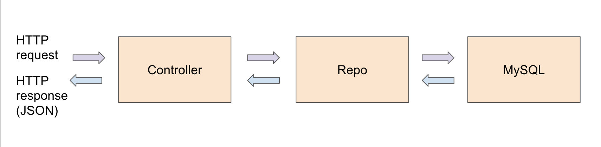
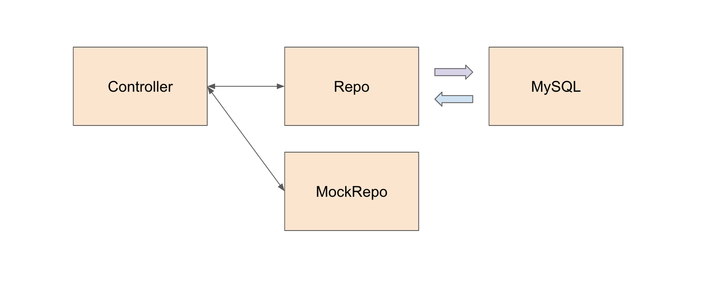
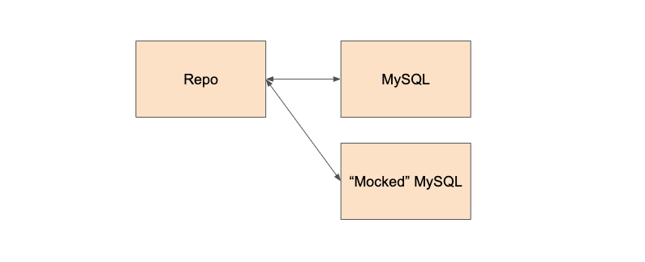

# Mocking

"Mocking" is a common technique for unit tests, especially in complicated systems. Remember how we mentioned multiple layers (controllers, repos, MySQL) in the webserver? Writing unit tests can be difficult because one layer depends on the functionality of another. How can we write a unit test for the controller when it depends on the repo working correctly? How can we write a unit test for a repo if it depends on a MySQL server working correctly?

As you can see from this diagram, these are the basic layers of the Orion webserver. When an incoming HTTP request reaches the webserver, it passes data to the controller layer, then the repo layer, and finally we retrieve/update information in MySQL. Once we are finished handling MySQL, we usually convert it into a Go struct/list (done in repo), then give that result to the controller to convert a Go struct into a JSON format.



Writing a unit test for controller, for example, will be difficult because we need to somehow guarantee the repo layer works. But the repo layer is difficult too because we need to guarantee MySQL works. But to truly know if MySQL works, we'll need to spin up a MySQL server, which is kind of a pain, especially for unit tests which should work fast.

Thus "mocking" was created to isolate layers for unit testing by "pretending" that certain layers worked. For example, let's say you had a `controller` method that did something like this:

```
func GetAllPrograms(c *gin.Context) {
    programList, err := repos.ProgramRepo.SelectAll()
	if err != nil {
		c.Error(err)
		c.String(http.StatusInternalServerError, err.Error())
        return
	}
    c.JSON(http.StatusOK, programList)
	return
}
```

If I wanted to write a unit test for this function, I need to first guarantee that `repos.ProgramRepo.SelectAll()` works correctly. When the webserver actually runs, I would have to create a few programs and save them into MySQL. With "mocking", we don't have to do this and simply "pretend" that `repos.ProgramRepo.SelectAll()` returns something. We can do this by using **interfaces**!

## Mocking in Golang (Interfaces)

Remember interfaces from school or from other languages? Golang has the same. An interface is a "class" that you can't instantiate and has no code - all it has are method signatures. A class implementing an interface must fill in code for all the interface methods.

In this scenario, we can use an interface for the `repo` layer. So the interface could look something like this:

```
type ProgramRepoInterface interface {
    SelectAll() []Program, error
    ...
}
```

From here, we can define TWO classes that implement this `programRepoInterface`. The first one class will be what we expect it to do (in real life). The second class will be what we want it to do during a unit test.

```
// This is the REAL ProgramRepo
var ProgramRepo ProgramRepoInterface = &programRepo{}
type programRepo struct {...}

// ProgramRepo has to implement all the functions in the ProgramRepoInterface (i.e. SelectAll)
```

```
// This is the "mocked" ProgramRepo only used in unit tests
var ProgramRepo mockProgramRepo
type mockProgramRepo struct { ... }

// mockProgramRepo has to implement all the functions in the ProgramRepoInterface (i.e. SelectAll)
```

The first class will do as we expect. It will execute a query on the connected MySQL server and retrieve results. When the results are finally retrieved, we transform them into Go structs / lists / values and return.

The second class is usually much simpler (since it's for a unit test) and we want it to give us full control over what we want it to return.

And so with this, a controller can choose to either use the real repo to fetch data from a MySQL server or use the test repo that returns fake data.



-------

## Using mocking in controller tests

In a controller test, you'll see something like this:

```
func TestGetAllPrograms_Success(t *testing.T) {
	MockProgramRepo.SelectAll = func() ([]domains.Program, error) {
		return []domains.Program{
			{
				Id:          1,
				ProgramId:   "prog1",
				Name:        "Program1",
                ...
			}
		}, nil
	}
	repos.ProgramRepo = &MockProgramRepo
    
    // Create new HTTP request to endpoint
	recorder := testUtils.SendHttpRequest(t, http.MethodGet, "/api/programs/all", nil)
    ...
}
```

What this does here is we are overriding the `SelectAll()` function of the MockProgramRepo (again, this is the "test" programRepo only used for unit-testing). We are telling this function to ALWAYS return a list of `Programs` (one in this case) with programId `prog1`.

If you look at the controller function associated to `api/programs/all`, somewhere in that code, there is a place where we call `ProgramRepo.SelectAll()`. Because we're using the mockProgramRepo in this case, we end up calling this mocked function (which returns a list containing a single Program `prog1`).

Now, we test if based on the result from the Repo, does the controller behave correctly? Does the response give a `200 OK`? Does the response have the correct JSON? Do we return a JSON array of one element? Is all the important data there?

Let's take a look at another example. Let's say we attempt to find a particular program, but we give an incorrect programId.

```
func TestGetProgram_Failure(t *testing.T) {
	MockProgramRepo.SelectByProgramId = func(programId string) (domains.Program, error) {
		return domains.Program{}, errors.New("not found")
	}
	repos.ProgramRepo = &MockProgramRepo

	// Create new HTTP request to endpoint
	recorder := testUtils.SendHttpRequest(t, http.MethodGet, "/api/programs/program/prog2", nil)
    ...
}
```

In this scenario, the `SelectByProgramId` function is overriden to always return an error with message `"not found"`. If the ProgramRepo is always returning this error message, does the controller behave correctly? Does it return a non-OK status code? Does it also display the message?

Hopefully from this perspective, you can see how we are able to fully control what the repo layer is giving us. We can have it give any Program object that we want and even an error. If we wanted to test more weird cases, we simply change what the mock function returns.

## Using mocking in repo tests

The philosophy behind the repo tests work similarly to the controller tests. We are using two "types" of MySQL layers. One is what you expect - the MySQL server is created, connected, and waits for retrieval / save requests. However, using a real MySQL server can be slow and can introduce a lot of complications. The other, is a "faked-out" MySQL which we want to use during unit tests. 



However, the syntax of how this works is slightly different. The library that we use for this MySQL mocking is called `sqlmock` ([docs](https://github.com/DATA-DOG/go-sqlmock)) created by the company [DataDog](https://www.datadoghq.com/).

A typical repo test looks like this:

```
func TestSelectAllPrograms(t *testing.T) {
	db, mock, repo := initProgramTest(t)
	defer db.Close()

	// Mock DB statements and execute
	rows := sqlmock.NewRows([]string{
        "Id",  
        "ProgramId", 
        "Name",
        ...}).
		AddRow(
            1, 
            "prog1",
            "Program1",
        ...)
	mock.ExpectPrepare("^SELECT (.+) FROM programs").
		ExpectQuery().
		WillReturnRows(rows)
	got, err := repo.SelectAll()
    ...
```

It's a bit easier to understand things from the bottom up. We are invoking `repo.SelectAll()` and either get a list of Program results or an error.
`mock.ExpectPrepare(...).ExpectQuery()` means that when `repo.SelectAll()` gets called, we are expecting a Prepare statement and a `.Query()` statement that matches the regular expression `"^SELECT (.+) FROM programs`.

This part is satisfied because somewhere in our repos.SelectAll() implementation, there's this statement:

```
stmt, err := pr.db.Prepare("SELECT * FROM programs WHERE ...")
```

The regular expression matches what you find in the `SelectAll()` function, so we're good!

In addition, there's a `WillReturnRows(rows)` part. This means when the above Query is called, return whatever is in the variable `rows` - which in this case is a list containing a single program with id `prog1` and name `Program1`.

Just like in the controller test, we are "pretending" MySQL works and having MySQL return a fake result. Given this result, does the repo function behave correctly? Does it successfully return a list of Go `Program` objects? Is the error that gets returned a `nil`?

With this, we've been able to create a unit test for the repo WITHOUT requiring to spin up a MySQL server. An additional bonus to us is that if we ever upgrade MySQL (right now, it's version 8, but we upgrade to version 9), maybe some things break during the upgrade. With these unit tests we are able to pinpoint which parts of MySQL are not allowed anymore and which are. With just integration tests, this could be harder to point out.

## What about integration tests?

Integration tests setup the whole thing - a local MySQL server, which is hooked up to an orion webserver. Integration tests are run by sending real HTTP requests to this setup orion webserver and then checking the responses that come back.

So when you create integration tests, there's no need for mocking! **However, the drawback here is that tests run much slower because we have to wait for HTTP queries to finish and MySQL data to persist.** Per query/save, it'll only take a few milliseconds, but if we have many tests, it adds up.

So this is why when you create integration tests, test general functionalities, but test more specific cases using the controller test.