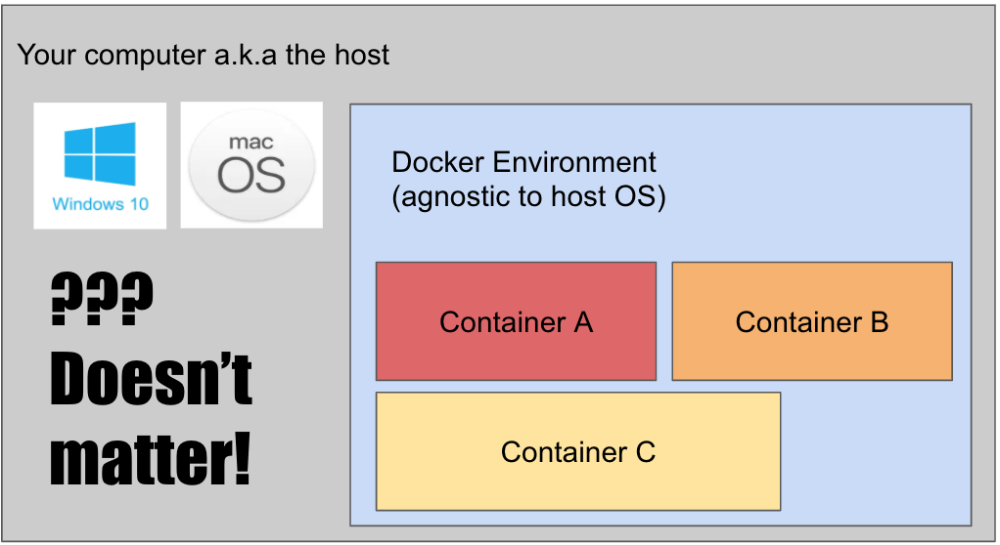

# What is Docker?

Before getting into Docker, we'll talk about this idea of virtualization and why it's very useful for programming environments.

## What is Virtualization?

Virtualization was created to combat the common issue of "it works on my computer but not yours". When developers are on different machines or different operating systems, software compatibility can be a very common and painful issue to solve. Virtualization creates a "virtual OS" on top of your current computer (which we refer to as the "host"). As an example, let's say I have a Mac computer and I want to run a Windows application. Normally, this wouldn't be allowed, but I can create a "pretend" Windows OS on my computer and then run the Windows application inside the fake Windows environment. 

Virtualization help developers dictate what base environment they want to work in. If everyone is guaranteed to be in the same environment, then we don't have to worry about a lot of compatibility issues! A lot of our interns will be working on different computers (Windows vs. Mac, very old comps vs new, etc.). So the same virtualized working-environment can go a long way with preventing people from bumping into compatability issues and coders can instead simply focus on the application code itself!

## Containerization & Docker

The problem with virtualized environments, however, is that they can really slow your computer down. When you have a virtualized environment, you are technically running two operating systems at the same time (your base, and the fake). Containers were created to solve the same problem with avoiding OS-compatibility issues but take up fewer resources Containers make programs as "bare-bones" as possible meaning you only get functionalities that are necessary. Because they're so "lightweight", we can also create many more containers than virtualization.

Docker is a Container management tool that helps developers manage containers both on their local host computer and online with DockerHub (the "Github" for Docker). Docker is perfect for our application because we have many microservices (mini-programs) where each service can each be isolated and neatly packed into a single container. This helps us onboard new developers very quickly (without installing bloated software like MySQL) and simplifies our application deployment process.

For a more technical dive into Docker, you can visit these youtube videos:

- <https://www.youtube.com/watch?v=JSLpG_spOBM>
- <https://www.youtube.com/watch?v=_dfLOzuIg2o>.

## Installing Docker

You can install Docker onto your computer [here](https://www.docker.com/get-started). Make sure to download Docker Desktop as it will help you visualize and manage your running Docker images. You may also sign up for a DockerHub account if you'd like, but it is not required.

---

[Continue](./01_docker_file.md)