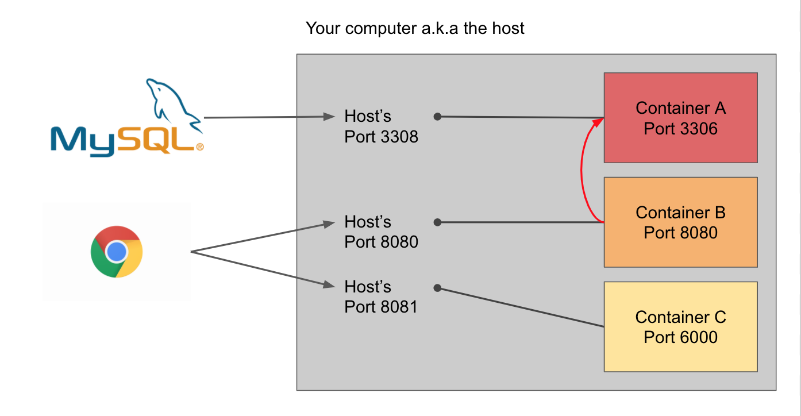

# Dockerfiles

For a container to be created, every service must contain a `Dockerfile` at the root of container's project directory. For MathNavigator, you can see that a `Dockerfile` exists in every project folder (i.e. `/orion`). The contents of a `Dockerfile` dictate how to build an *image* of a container. You can think of a Docker *container* as a class (in Object-Oriented programming) while a Docker *image* is like an instance. So containers are the blueprints while the images are instances of that blueprint.

In the `Dockerfile`, we usually specify the following:

- `FROM` - what type of base image (i.e. golang, nodeJs, mySql, ubuntu, etc.) the container is
- Environment variables
- Copying over code files from host to container
- Setting up and running the application on the container
- **Exposing a port which the host can communicate with the container**

Containers are meant to be small, isolated programs that run on your computer (i.e. the host). Because they're isolated, we want to limit who gets access to the container. Sometimes containers can communicate with each other, but we should strictly specify who gets to. All containers can be communicated by the host, but we have to specify how. And we do so be specifying a mapping between a host computer's port to a container's port.

In the diagram below we can see 3 containers, each container can be accessed through 3 ports.

- The host port 3308 maps to the container's port 3306
- The host port 8080 maps to the container's port 8080
- The host port 8081 maps to the container's port 6000

In order to access the containers, you could use MySQL to connect to <http://localhost:3306>. Or you could use Chrome to connect to <http://localhost:8080> or <http://localhost:8081>.

## Docker-Compose

You can manage a single Docker container with the `docker` CLI. When you need to quickly deploy multiple containers at once, use `docker-compose`! Docker-Compose builds across multiple Dockerfiles and can dictate how services can communicate with each other. We'll learn more about CLI commands in the next section.

---

[Continue](./02_docker_cli.md)