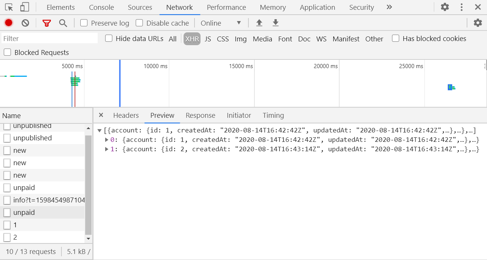

## Understanding Inspect Network
The Network Panel allows you to inspect resources as they are accessed over the network. 

### Opening Inspect Network
    - Ctrl  + Shift + J to open the Console, and toggle "Network". Then, refresh your page. 

### Inspect Network

- **Filtering**
    - If you are looking for a specific type of resource, you can filter the data using the tabs under
    filter. (All, XHR, JS, CSS, Img, etc) Most of these of self-explanatory except for XHR. 

#### XHR?
- In this tab, you will be able to check the requested API endpoints. You can select the Name of the resource 
to see what is included in the API endpoint. This allows you to check if the API is getting the correct information. It makes returning an object and its atrribrutes a lot easier because all the attribrutes and their values are listed out ofr each object. 

The image below shows how the API endpoint `api/accounts/unpaid` is called in the Admin Home Dashboard for Unpaid Accounts: 

- **Sorting the Resources**
    - You will see the Network Log with columns labeled: Name, Status, Type, Initiator, Size, Time, Waterfall. 
    If you want to sort the resources in the table, just click on a column label. An upwards triangle
    means ascending and downwards means descending. 
        - Status: The HTTP response code
        - Initiator: What caused a resource to be requested. Clicking a link in the Initiator column takes you to the source code that caused the request.
        - Time: How long the request took.
        - Waterfall: A graphical representation of the different stages of the request. Hover over a Waterfall to see a breakdown.

You can also check out this link: https://www.techrepublic.com/blog/web-designer/google-chrome-dev-tools-network-panel/
