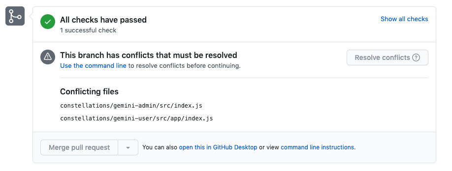

# What is a Merge Conflict?

- Watch the first minute of <https://www.youtube.com/watch?v=MzpW-k66XE8>

A Merge Conflict occurs when two branches are trying to merge but have conflicting changed lines/files. Usually, there are particular line(s) in a certain file that has been edited by both branches and Git is unable to automatically resolve how to combine these changes. When merge conflicts are detected, Git will automatically generate un-compileable lines into your code and prevent you from merging branches. Merge conflicts sound intimidating but they follow a pattern. Once you figure out that pattern, they're not too bad to work with!

## What do they look like?

Merge conflicts are often seen on Github Pull Requests. GitHub will show which files are unable to correctly merge and prevent the current feature branch from merging with the master branch.



Sometimes, they may occur when a developer calls `git pull origin master`. If the remote *master* branch has had many changes, the local feature branch may be too "out-of-sync" with the original *master* codebase so a pull is required. When the pull happens, there could be some files that the developer was working on but now have changed because of the new updates to *master*. You might see something like this:

```
```

## How to resolve a merge conflict?

- How to resolve merge conflicts: <https://www.youtube.com/watch?v=g8BRcB9NLp4>
